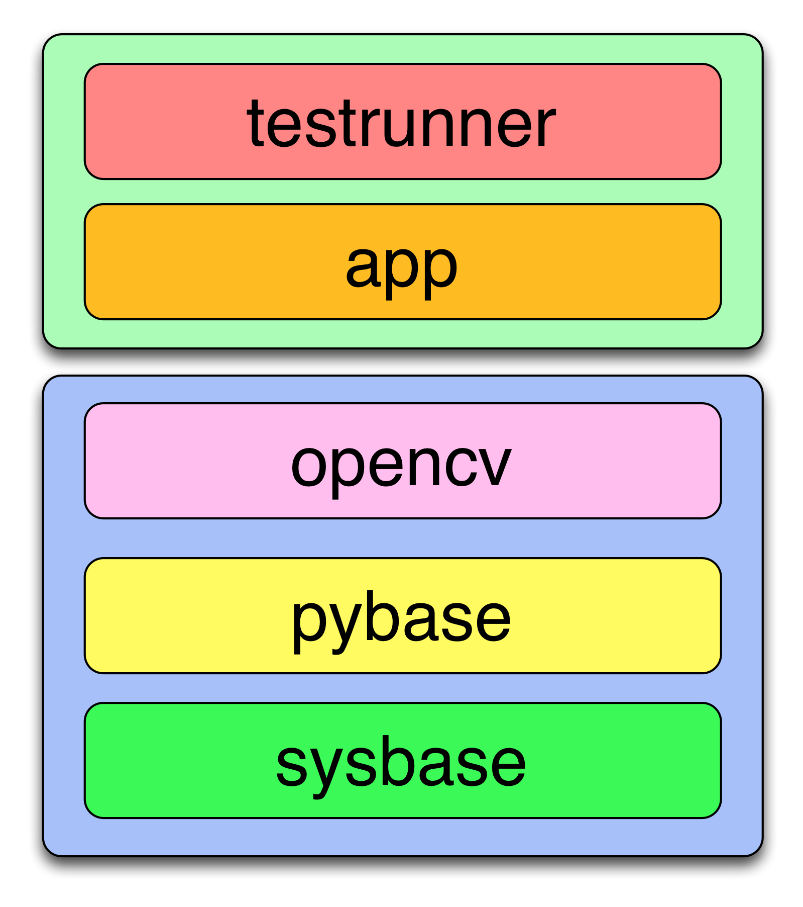

# Flask Web App Example

This example builds a set of Docker image layers that shows how
to set up a simple Python web app using Flask as a web server,
running under Uwsgi, fronted by an Nginx reverse proxy.

The FlyingCloud configuration files configure the layers.

The Flask app uses OpenCV to display an image
that is run through the Canny edge-detection filter.
This example shows how to build Docker layers
that have some complex C-libraries and workarounds
that would normally be scripted in Bash.

There is a `testrunner` layer that can run tests inside the Docker container
to show that you can test the exact artifact
in the exact environment that will be deployed to production.

## Installing the Example App, FlyingCloud, and Docker

### Prerequisites

* Linux
  * You must install Docker—see [Docker installation instructions for Linux](https://docs.docker.com/linux/step_one/)
* Mac OS X
  * You must install the [Docker Toolbox](https://www.docker.com/products/docker-toolbox)
  * You must have a running Docker Machine instance—see the Docker Toolbox docs.
  * You must have configured your shell to talk to the docker daemon running
    inside docker-machine
    * For instance, `eval $(docker-machine env default)`
* Windows
  * We don't support Windows currently.
    If you run Windows and get FlyingCloud to work, contact us!

You must build the layers in order—there is no make-style dependency system.

* `git clone https://github.com/cookbrite/flyingcloud.git`
* `cd flyingcloud`
* Create a virtual environment.
* `python setup.py develop`
* `cd examples/flask-web-app`
* `flyingcloud -h` to see the help and what layers you can build
* `flyingcloud sysbase` to build the OS base layer with SaltStack
* `flyingcloud pybase` to build the Python layer with
    modern Python 2.7.11 and a virtualenv in `/venv`
* `flyingcloud opencv` to build the layer with OpenCV libraries.
* `flyingcloud app` to build the flask app layer. This is the layer that you will deploy.
* `flyingcloud --run testrunner` to run tests inside the Flask app layer.

## Tips

* To see what the build is doing, `tail -f flyingcloud.log` (perhaps in another window)
* To run the `app` image locally, so that you can see it at http://localhost:8080/
  * `flyingcloud --run app`
  * This does a `docker run`, publishing the container's port 80 on the host's port 8080.
    On Mac, it also tunnels port 8080 via Docker Machine to port 80 inside the container.
* To kill the `app` image:
  * `flyingcloud --kill app`
* To enter the Docker container:
  * Get the container id:
  * `sudo docker ps` and find the `container_id` for `flaskexample_app`.
  * `sudo docker exec -it <container_id> /bin/bash`
    — run an interactive Bash shell in the container
  * Tip: `sudo docker exec -it $(sudo docker ps -q|head) /bin/bash`
    runs Bash inside the most recent container.
  * Note: on Mac, you should use `docker` instead of `sudo docker`.
  
  
## Running the Flask App Locally

* `cd examples/flask-web-app/salt/app/application/flask_example_app`
* `pip install -r requirements.txt`
* Note: you will have to install python-opencv manually
* `./app.py`

## Running Example Tests Locally

* `pytest tests`